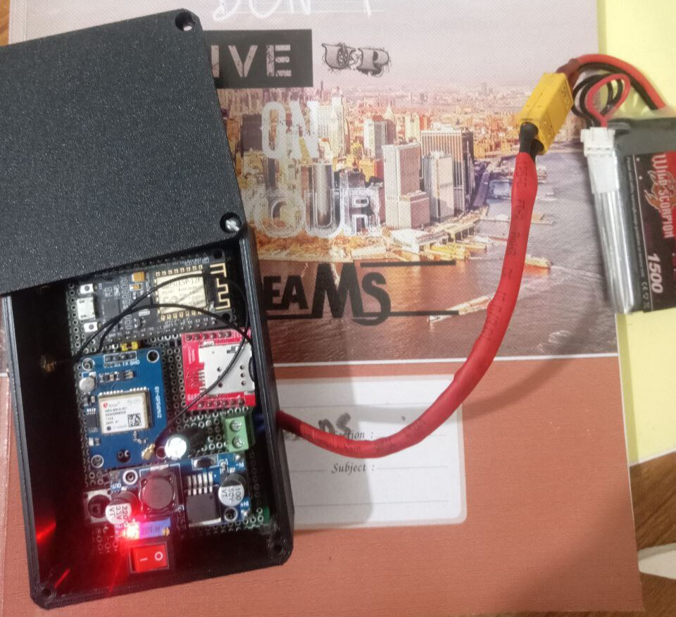

# GPS Tracker Hardware

## Project Overview

The GPS Tracker Hardware is an essential component of the Shahjalal University of Science and Technology (SUST) Bus Tracking System. This hardware is designed to collect GPS data from buses and transmit it to the central server for real-time bus tracking.

## Hardware Components

- **ESP8266 Microcontroller**: This microcontroller is at the core of the GPS tracker hardware. It is responsible for data collection, communication, and managing power.

- **Neo-6M GPS Module**: The Neo-6M GPS module provides accurate GPS location data, including latitude and longitude coordinates.

- **SIM800L GSM Module**: The SIM800L GSM module handles real-time data transmission via mobile networks, allowing data to be sent to the central server.

- **Buck Module**: The buck module is used to efficiently manage the power supply, optimizing power consumption for extended operation.

